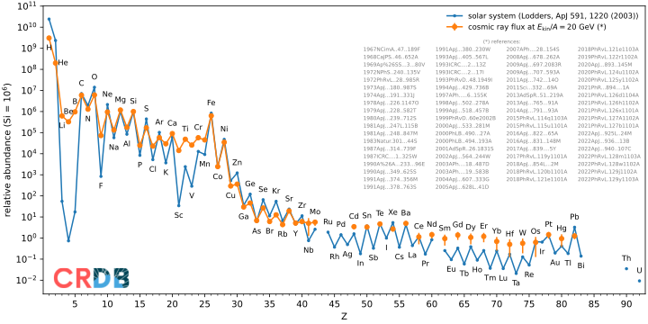
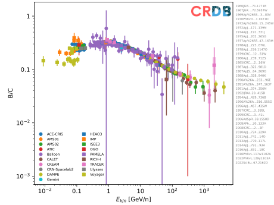
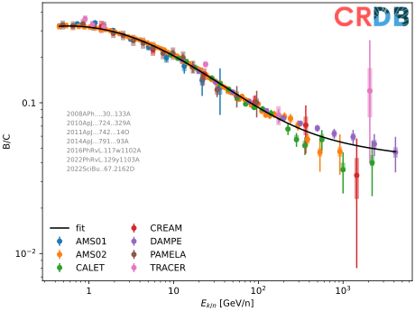
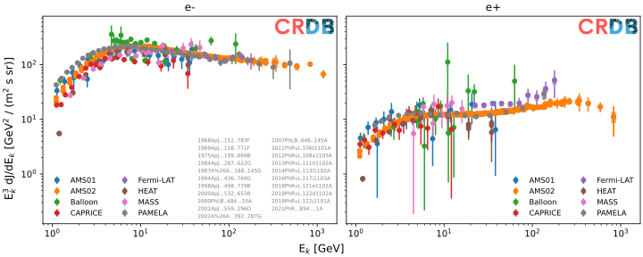
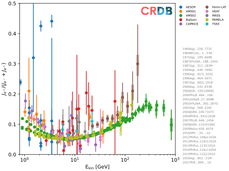
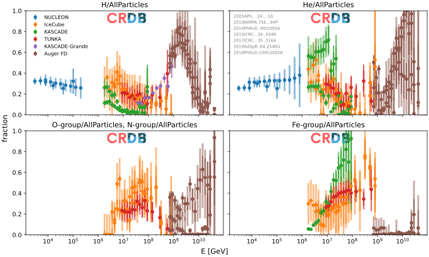
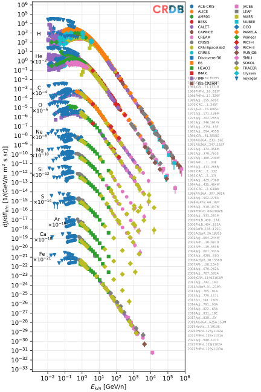
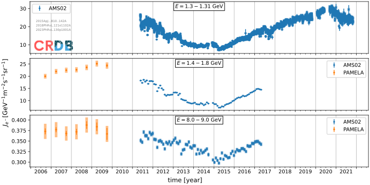
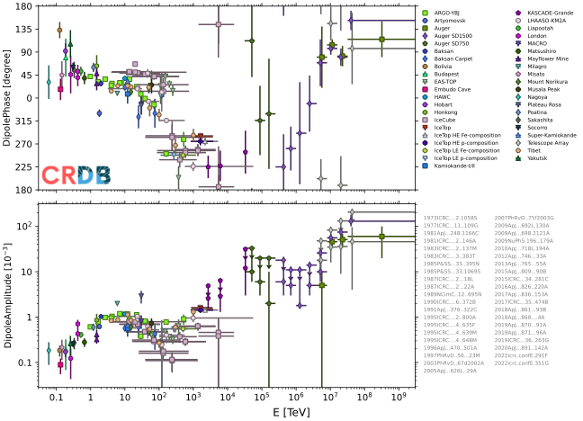

#  Tutorial

Welcome to the [CRDB](https://lpsc.in2p3.fr/crdb) tutorial repository.

Our basic [tutorial](./tutorial.ipynb) shows how to use CRDB via the low-level REST interface or via the high-level Python package `crdb`.

Our [gallery](./gallery.ipynb) shows how to make standard plots in Python with CRDB data using the high-level Python package `crdb`. Below you can see a preview of these plots.

